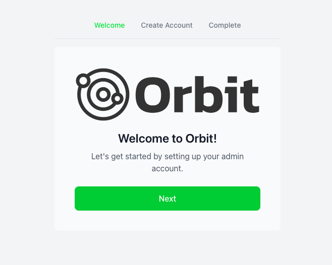
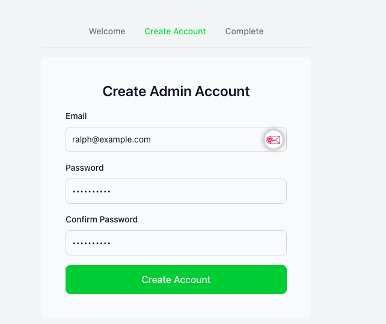
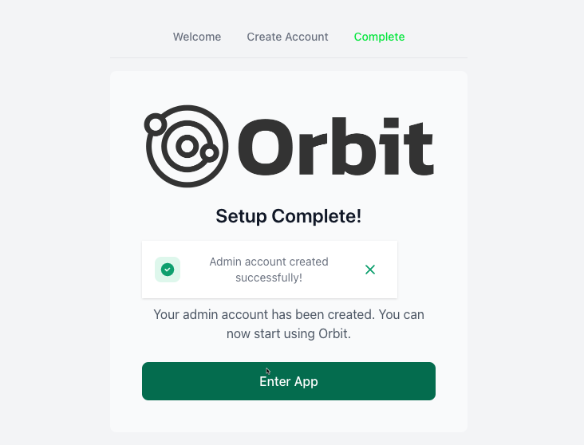

# Setting Up Orbit

This guide will walk you through the initial setup process using the Orbit web interface.

## Initial Login

After starting Orbit, navigate to `http://localhost:8090` in your browser.

Enter your API key to access the dashboard.

## Dashboard Overview

Once logged in, you'll see the main dashboard.

The dashboard provides an overview of your scanning activities and recent findings.

## Creating Your First Scan

### Step 1: Navigate to Scans
Click on the "Scans" section in the sidebar.

### Step 2: Create New Scan
Click the "New Scan" button in the top right corner.

### Step 3: Configure Scan Settings
Fill in the scan configuration:

1. Enter the target URL or IP
2. Select scan type
3. Configure scan options
4. Set schedule (optional)

### Step 4: Start Scan
Click "Start Scan" to begin the scanning process.

## Viewing Results

### Scan Progress
Monitor the scan progress in real-time.

### Findings
View detailed findings once the scan is complete.

## Managing Templates

### Accessing Templates
Navigate to the Templates section to manage your Nuclei templates.

### Adding Custom Templates
Add your own custom templates:

1. Click "Add Template"
2. Upload or paste your template
3. Save and verify

## Configuration Settings

### API Settings
Configure API settings and integrations.

### Notification Setup
Set up notifications for scan results.

## Best Practices

1. **Regular Updates**: Keep your templates updated
2. **Scan Scheduling**: Set up recurring scans for continuous monitoring
3. **Resource Management**: Monitor system resources during scans
4. **Template Organization**: Maintain a clear structure for custom templates

## Troubleshooting

If you encounter issues during setup:

1. Check the logs using `./orbit logs`
2. Verify your API key
3. Ensure all required ports are accessible
4. Join our [Discord community](https://discord.gg/BHIS) for support 